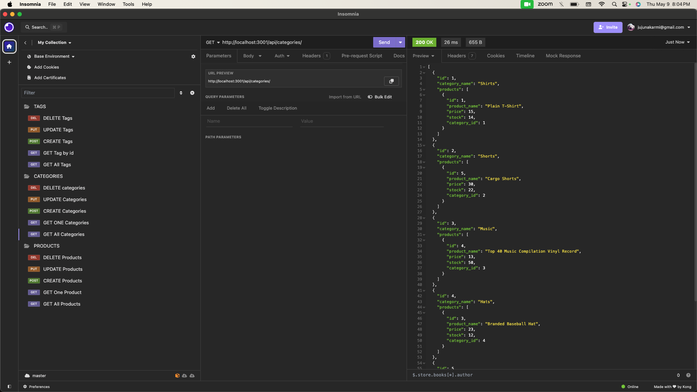
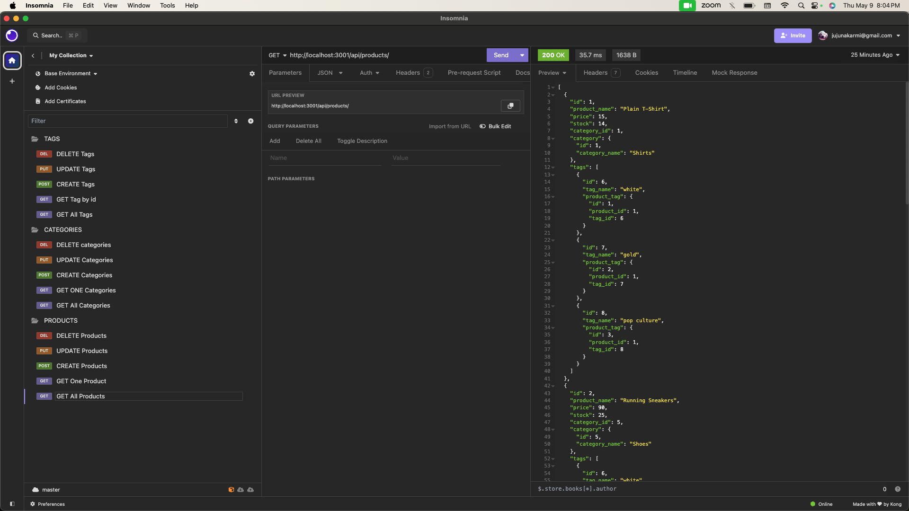
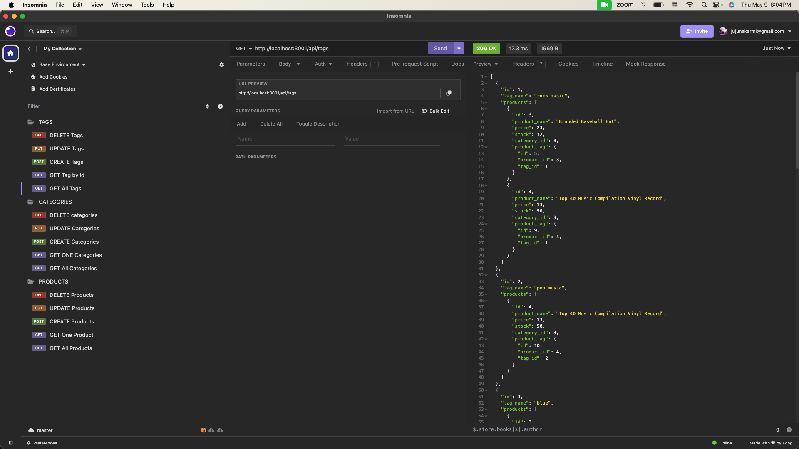

# Note Taker

 

# Description
This application creates the backend of a e-comerce website by useing Express.js API and Sequelize to interact with a MySQL database.

Here is the link to demo video walkthrough:
[Click on this link](https://drive.google.com/file/d/1x0zo0c1oQCru_0J_CbmLs4jZzfxuBa8C/view?usp=sharing)

  ## Table of Contents

* [Installation](#installation)
* [Usage](#usage)
* [Screenshots](#screenshots)
* [License](#license)
* [Contributing](#contributing)
* [Contact](#contact)

## Installation

`git clone` the repo to your local machine. To use this application, please run the following command:

`npm install`.

And then run the following commands to install the dependencies if you are not sure if they are up to date: 

`npm i inquirer`

`npm i sequelize`

`npm i dotenv`

`npm i express`

## Usage

Type the following command in your termimal:
`mysql -u root -p` -- connect to your database and then run: 

`source schema.sql`

Quit mySQL shell. Run the following command to seed the files:

`npm run seed`.

Then run:

`npm start`

## Screenshots
Here are some of the screenshots of the application.

## License

## Contributing

There are no guidelines for contributing at this time. Contact me with any ideas or requests if anybody want to contribute.

## Contact
* Email: jujunakarmi@gmail.com
* LinkedIn:[https://www.linkedin.com/in/juju-nakarmi-1a79a7181/](https://www.linkedin.com/in/juju-nakarmi-1a79a7181/)